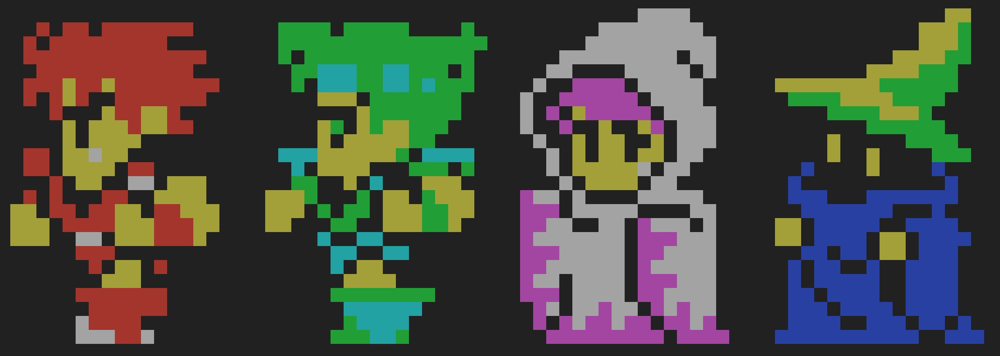
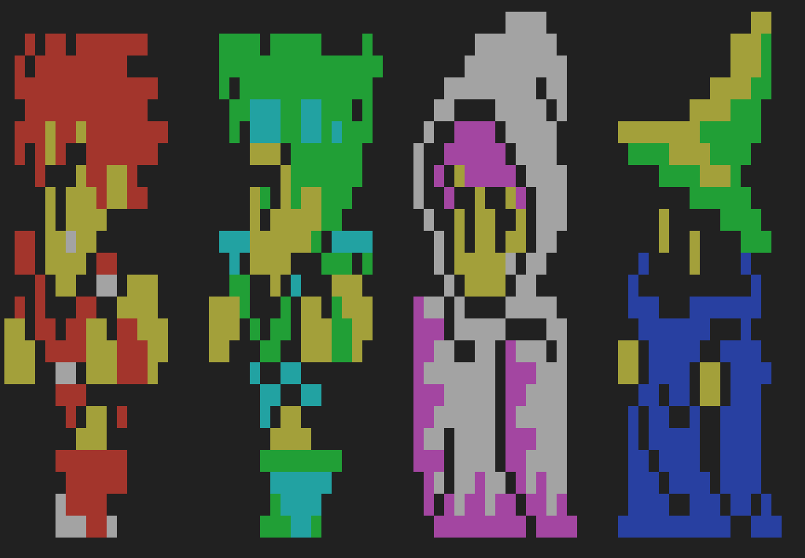
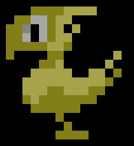
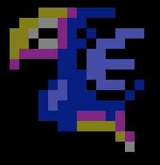
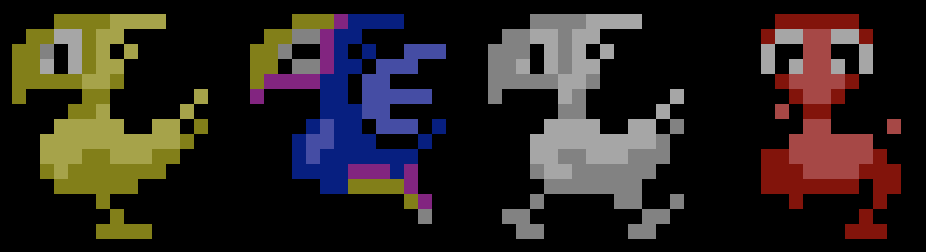
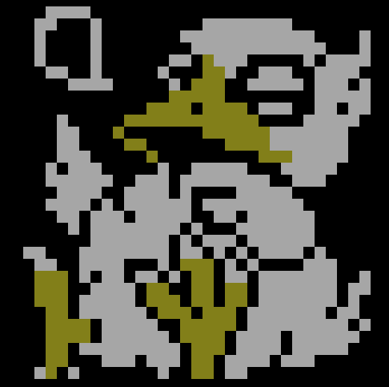

## 下記の gist を /etc/motd に貼り付けることで可能です
※debian系なら /etc/motd.tail にどうぞ

### batz


[gist:batz.txt](https://gist.githubusercontent.com/makocchi-git/9775443/raw/82993c6c1d982447e7e99def4f58fc14fc234665/batz.txt)

### galuf


[gist:galuf.txt](https://gist.githubusercontent.com/makocchi-git/9775443/raw/76261981a24f329e333850118f24db407954bb15/galuf.txt)

### 白魔道士


[gist:siromadousi.txt](https://gist.githubusercontent.com/makocchi-git/9775443/raw/fa10bbd1a4a59262baa5ce15837c9fd78439bac5/siromadousi.txt)

### 黒魔道士


[gist:kuromadousi.txt](https://gist.githubusercontent.com/makocchi-git/9775443/raw/b27b48e808fe72b857abab60a43d196f84af25e7/kuromadousi.txt)

### 4人全部


[gist:allstar.txt](https://gist.githubusercontent.com/makocchi-git/9775443/raw/a713b3003c709702acb33b7f4e4d92dc94ea4807/allstar.txt)

### 4人全部の幅半分version


[gist:allstar_half.txt](https://gist.githubusercontent.com/makocchi-git/9775443/raw/e360e02c14b4958f9d95768ae025b707e5733fba/allstar_half.txt)

### チョコボ


[gist:chocobo.txt](https://gist.githubusercontent.com/makocchi-git/9775443/raw/427d084cd69d177cb2758cc1751b4ee3b76cf685/chocobo.txt)

### 黒チョコボ


[gist:kuro-chocobo.txt](https://gist.githubusercontent.com/makocchi-git/9775443/raw/da9f4821519f75cbb0fbf4e39cb786826ed91fa2/kuro-chocobo.txt)

### 白チョコボ


[gist:siro-chocobo.txt](https://gist.githubusercontent.com/makocchi-git/9775443/raw/474f9b6734c736d5d85b59de916840effc769f0a/siro-chocobo.txt)

### 赤チョコボ


[gist:aka-chocobo.txt](https://gist.githubusercontent.com/makocchi-git/9775443/raw/42714d30eb0959e510f058b0fcfad617060d2bcb/aka-chocobo.txt)

### チョコボ4匹


[gist:chocobo-allstar.txt](https://gist.githubusercontent.com/makocchi-git/9775443/raw/70b3e0250a0d07be3c4dcdaed3dff5662e2a7ab4/chocobo-allstar.txt)

### デブチョコボ


[gist:fat-chocobo.txt](https://gist.githubusercontent.com/makocchi-git/9775443/raw/c4f98b5aed61490146f7f1d248d6c67b0f662ea0/fat-chocobo.txt)

### モーグリ各種


[gist:moogle.txt](https://gist.githubusercontent.com/makocchi-git/9775443/raw/6478843a63d491ea7557c448a6b56b014b110b6a/moogle.txt)


[gist:moogle-side.txt](https://gist.githubusercontent.com/makocchi-git/9775443/raw/4182ece463b1f0f48c400c25e8d66769a6e3fa51/moogle-side.txt)


[gist:moogle-back.txt](https://gist.githubusercontent.com/makocchi-git/9775443/raw/2e81ccd6f2e24a66932b8a1f209a3603e313985a/moogle-back.txt)

### モーグリ詰め合わせ


[gist:moogle-allstar.txt](https://gist.githubusercontent.com/makocchi-git/9775443/raw/88f24b8545aa884e45bca79e7a92c8843650dc65/moogle-allstar.txt)

### こんな感じでどうぞ
```bash
$ curl -s <gistのurl> | sudo tee -a /etc/motd
```
